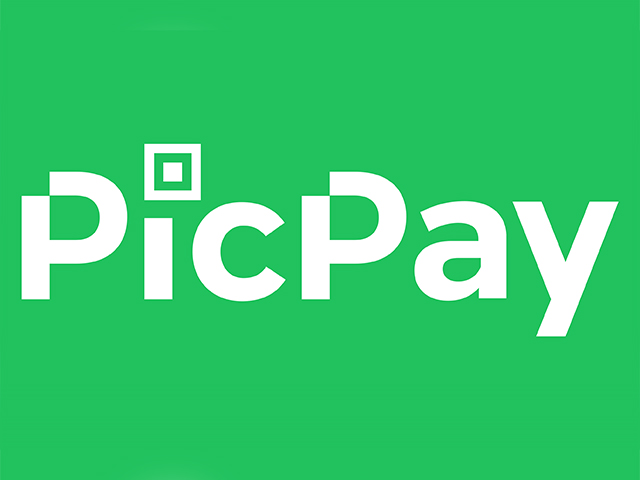

<p align="center">
  
</p>

<h3 align="center">Desafio Backend - PicPay</h3>

<p align="center">
  
  
  
</p>

---

## 🧭 Visão Geral

Este projeto implementa uma **solução backend simplificada inspirada no PicPay**, onde é possível **criar carteiras digitais (wallets)** e realizar **transferências entre usuários**.  
O sistema valida **autorização de transferência via serviço externo** e **envio de notificações simuladas**.

---

## 📚 Sumário
- [🧭 Visão Geral](#-visão-geral)
- [📚 Sumário](#-sumário)
- [⚙️ Tecnologias Utilizadas](#️-tecnologias-utilizadas)
- [🏗️ Arquitetura da Solução](#️-arquitetura-da-solução)
- [🚀 Execução do Projeto](#-execução-do-projeto)
  - [✅ Pré-requisitos](#-pré-requisitos)
  - [📥 Clonar o repositório](#-clonar-o-repositório)
  - [🐳 Subir containers](#-subir-containers)
  - [▶️ Rodar a aplicação](#️-rodar-a-aplicação)
  - [🧩 Banco de Dados](#-banco-de-dados)
- [💬 Interagindo com a API](#-interagindo-com-a-api)
- [📬 Endpoints e Exemplos](#-endpoints-e-exemplos)
  - [1️⃣ Criar carteira — `POST /wallets`](#1️⃣-criar-carteira--post-wallets)
  - [2️⃣ Realizar transferência — `POST /transfer`](#2️⃣-realizar-transferência--post-transfer)
- [🤝 Contribuições](#-contribuições)
- [🔗 Referências e Créditos](#-referências-e-créditos)

---

## ⚙️ Tecnologias Utilizadas

| Tecnologia | Finalidade |
|-------------|-------------|
| ☕ **Java 25** | Linguagem principal |
| 🍃 **Spring Boot 3.x** | Framework de aplicação |
| 🧩 **Spring Data JPA / MySQL** | Persistência relacional |
| ✅ **Spring Boot Validation (Jakarta)** | Validação de dados de entrada via anotações (`@NotNull`, `@Blank`, etc.) |
| 🩺 **Spring Boot Actuator** | Monitoramento e métricas da aplicação (`/actuator/health`) |
| ⚡ **Spring Boot DevTools** | Hot reload e ferramentas de desenvolvimento |
| 🌐 **Spring Cloud OpenFeign** | Integração com APIs externas (autorização e notificação) |
| 🧰 **Lombok** | Redução de boilerplate |
| 🐳 **Docker** | Containerização do ambiente |


---

## 🏗️ Arquitetura da Solução

```
[Cliente / Postman]
        ↓
  REST API (Spring Boot)
        ↓
 [WalletController]
   ├── POST /wallets → cria carteira
   └── POST /transfer → realiza transferência
        ↓
 [Serviços]
   ├── WalletService
   ├── TransferService
   └── FeignClients (Autorizador / Notificação)
        ↓
 [Banco de Dados MySQL]
```

---

## 🚀 Execução do Projeto

### ✅ Pré-requisitos
- **Java 25+**
- **Maven 3.9+**
- **Docker (opcional)**

### 📥 Clonar o repositório

```bash
git clone https://github.com/erichiroshi/desafio-backend-picpay.git
cd desafio-backend-picpay
```

### 🐳 Subir containers
Na pasta `docker/`, execute:
```bash
docker-compose up -d
```

### ▶️ Rodar a aplicação

```bash
./mvnw spring-boot:run
```

A aplicação estará disponível em:  
👉 [http://localhost:8080](http://localhost:8080)

### 🧩 Banco de Dados
Por padrão, a aplicação utiliza o **mysql + phpmyadmin**.  
Para acessar o console:  
👉 [http://localhost:8081/](http://localhost:8081/)

---

## 💬 Interagindo com a API

As requisições podem ser testadas via **Postman** ou **Insomnia**.

---

## 📬 Endpoints e Exemplos

### 1️⃣ Criar carteira — `POST /wallets`

**Request Body**
```json
{
    "fullName": "Eric",
    "cpfCnpj": "12345678900",
    "email": "eric@teste.com",
    "password": "123",
    "walletType": "USER"
}
```

**Response**
```json
{
    "id": 3,
    "fullName": "Eric",
    "cpfCnpj": "12345678900",
    "email": "eric@teste.com",
    "password": "123",
    "balance": 0,
    "walletType": {
        "id": 2,
        "description": "merchant"
    },
    "transferAllowedForWalletType": true
}
```

---

### 2️⃣ Realizar transferência — `POST /transfer`

**Request Body**
```json
{
    "value": "10",
    "payer": "1",
    "payee": "4"
}
```

**Response de sucesso**
```json
{
    "id": "855e40ba-bed7-4acc-959c-4a224d64101f",
    "sender": {
        "id": 1,
        "fullName": "Bob Brown",
        "cpfCnpj": "111.111.111-11",
        "email": "bob@gmail",
        "password": "123",
        "balance": 40.00,
        "walletType": {
            "id": 1,
            "description": "user"
        },
        "transferAllowedForWalletType": true
    },
    "receiver": {
        "id": 4,
        "fullName": "Ericd",
        "cpfCnpj": "1234567d8900",
        "email": "ericd@teste.com",
        "password": "123",
        "balance": 10.00,
        "walletType": {
            "id": 1,
            "description": "user"
        },
        "transferAllowedForWalletType": true
    },
    "amount": 10
}
```

**Possível resposta (autorização negada)**
```json
{
  "status": "422 Unprocessable Enity",
  "message": "Authorization service not authorized this transfer."
}
```

**Possível resposta (falha de notificação)**
```json
{
  "log error": "Error during send notification: , status code is not OK."
}
```

---

## 🤝 Contribuições

Contribuições são sempre bem-vindas!  
Para contribuir:

1. Crie um fork do repositório.  
2. Crie uma branch de feature:  
   ```bash
   git checkout -b feature/nome-da-feature
   ```
3. Commit suas mudanças:  
   ```bash
   git commit -m "feat: nova funcionalidade"
   ```
4. Envie um Pull Request.  

📜 **Boas práticas**
- Adicione testes unitários.  
- Documente suas alterações no código.  
- Use mensagens de commit seguindo o padrão **Conventional Commits**.

---

## 🔗 Referências e Créditos

- Desafio original: [PicPay Desafio Backend](https://github.com/PicPay/picpay-desafio-backend)
- Baseado no conteúdo do canal [Build & Run](https://www.youtube.com/watch?v=dttXo48oXt4&list=PLxCh3SsamNs7y1Y-QaVdWx0MUh0wvo7TV&index=2)

- Repositório do projeto: [desafio-backend-picpay](https://github.com/erichiroshi/desafio-backend-picpay)
- Desenvolvido por [**Eric Hiroshi**](https://github.com/erichiroshi)
- Licença: [MIT](LICENSE)

---

<p align="center">
  <em>“Código limpo é aquele que foi escrito com clareza, empatia e propósito.”</em>
</p>
